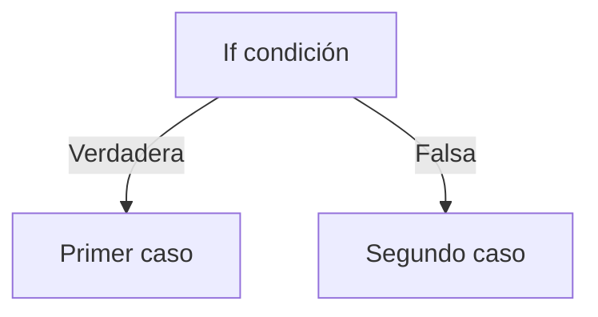

[[Indice]]

# Pensamiento algorítmico

> [!NOTE] Contenidos
> Construir algoritmos básicos utilizando representaciones textuales y diagramáticas, justificando la secuencia lógica de pasos.


## Objetivos:

Al final de la clase deberían poder:

- [ ] Ser capaces de analizar problemas simples.
- [ ] Identificar **entradas y salidas** de un código.
- [ ] Escribir un **algoritmo en texto (pseudopasos)**.
- [ ] Elementos que podemos programar


---

#### ¿Por qué nos interesa programar?


---

- Hacer una página web interactiva
- Crear un videojuego indie
- Generar una aplicación móvil
- Arreglar computadores
- Crear un LLM
- Automatizar procesos
---


---

> [!NOTE] Repasemos...
> ¿Qué era un algoritmo?


---

<div style="display:flex; gap:20px; align-items:center;">

<div>


- Mostrar el resultado

- Sumar los números

- Leer dos números
- Dividir por 2 

</div>

<div style="font-size:40px;">
}
</div>

<div>

¿Es esto un algoritmo?

</div>

</div>

---

Los algoritmos tienen un orden lógico y producen un resultado final.

---


Orden correcto:

1. Leer dos números
2. Sumar los números
3. Dividir por 2
4. Mostrar resultado


---

## ¿Qué es un algoritmo?

Un algoritmo se compone de

  $$ Entrada → Proceso → Salida$$

De acuerdo a Donald Knuth, los algoritmos tienen 5 características:

1. Finitud
2. Proceso definido
3. Datos de entrada
4. Información de salida
5. Efectividad

---
1. Finitud

Debe haber al menos una condición en la cual el código pueda terminar (excepto en casos muy puntuales).

2. Proceso definido

Cada paso del proceso debe estar bien definido y sin ambigüedad.

---

3. Datos de entrada

Un algoritmo puede tener datos de entrada que serán procesados y generarán la información del resultado final. Debemos fijarnos en cómo está organizada la información, y qué información es la relevante.

4. Información de salida

Resultado del procesamiento de los datos.

---

5. Efectividad

El algoritmo debe hacer lo que se supone que debe hacer y no otra cosa.

---


¿Qué pasa entonces con códigos como estos?

| Código 1                                 | Código 2                                                  |
| ---------------------------------------- | --------------------------------------------------------- |
| 1. Imprimir "hola mundo".<br>2. terminar | 1. Imprimir todos los números del 1 al 10.<br>2. terminar |
|                                          |                                                           |

¿Son algoritmos?

---
```python

# "imprimir" la frase "hola mundo"
print("hola mundo")

```
---
Esta clase de algoritmos son más comparables a "seguir una rutina de ejercicios" que a una receta de cocina.

---

Podemos generar códigos sin inputs, pero nunca sin salida.

[[Semana 1 ej]]

---
### ¿Qué es computable y qué no?

Antes de continuar... ¿Qué cosas podemos hacer en código? 

Muchísimas! <!-- .element: class="fragment" -->
Pero en este curso solo nos enfocaremos en algunas: <!-- .element: class="fragment" -->

---

- bucles (for, while)
- condicionales (if, else)
- aritmética (+,-,*,**,/,//)
- desigualdades (<,>, =, !=) etc.
- booleanos (True, False)
- listas ($[pollo, arroz, gengibre, etc]$)

---
##### Un ejemplo:

![[Pasted image 20260310163857.png]]

---

![[Pasted image 20260310163916.png]]

---
#### bucles (for, while)

- while → mientras
- for → recorre un listado

---
Por ejemplo, "while" es útil cuando queremos imponer una condición para que siga o se rompa el bucle:

![[Pasted image 20260312175457.png]]

---

Ej:

> Leer los números que ingresa un usuario hasta que el número sea 0

1. número = 0
2. Mientras numero ≠ 0  → hacer → Mostrar numero  
3. Fin

---
"for" es útil cuando sabemos cuántas veces algo se va a repetir:

Ej:

> Para cada alumno de fundamentos de programación, colocar un 7.

---

Ej:

> Recorrer cada número del 1 al 5

---

1. Para un número x del 1 al 5:
2. mostrar x
---

``` python

for i in range(1, 6):
    print(i)

```

---

> Mostrar los primeros 5 dígitos de la secuencia al aplicar la función $2x+3$ 


---

1. Para cada x desde el 1 al 5
2.   mostrar 2x + 3

``` python

for i in range(1, 6):
    print(2*i + 3)

```


---

Entonces, "for" es más útil cuando tenemos un número finito de objetos, números o una lista de cosas que queremos recorrer completamente, y hacer algo con cada elemento de esa lista.

"while" es cuando estamos esperando que se cumpla una condición, cuando buscamos algún elemento, o tenemos un objetivo, y apenas se logre ese objetivo cortaremos el ciclo.

---

![[Pasted image 20260312181931.png]]

---


``` python

a = 1

while a < 5:
    print(a)
    a +=1
```


``` python

for i in range(1, 5):
    print(i)
```

---

while → mientras, va a seguir hasta que se cumpla una condición
for → para, recorre un listado, sabemos cuántas veces se repetirá

---

> Problema: Identifique qué herramienta sería mejor para cada caso:

Problemas:

1️⃣ Leer 10 números definidos 1, 2, 3...10 
2️⃣ Leer números hasta que aparezca un negativo 
3️⃣ Mostrar los números del 1 al 100 
4️⃣ Leer contraseñas hasta que sea correcta

---

1️⃣ Leer 10 números definidos → <!-- .element: class="fragment" --> **for**  
2️⃣ Leer números hasta que aparezca un negativo → <!-- .element: class="fragment" --> **while**  
3️⃣ Mostrar los números del 1 al 100 → <!-- .element: class="fragment" --> **for**  
4️⃣ Leer contraseñas hasta que sea correcta → <!-- .element: class="fragment" --> **while**

---

> Eres un programador y te piden hacer una app que restrinja el tiempo en redes sociales de los usuarios. El usuario registra un tiempo máximo que puede estar en la red social, y la aplicación tiene un contador ya instalado de cuánto tiempo el usuario está en la app, que se actualiza a cada segundo. 

---

1. Leer tiempo máximo del usuario
2. Mientras el usuario no pasa del tiempo máximo 
3. → seguir midiendo
4. Bloquear aplicación


---

#### Condicionales (if, else)

Esto es colocar una condición. 

1. Si ocurre esto (if) →  tal cosa ocurre en el código
2. Si no (else) →  hacer esto otro

---



---
![[Pasted image 20260312184348.png]]

---

![[Pasted image 20260312184235.png]]

---

``` python

numero = -5

if numero < 5:
    print(numero)
else:
    print("no cumple")
```

---

if también impone un condicional al igual que while, pero while es un bucle, mientras que if solo pregunta en el momento en que la línea de código es leída.


---

Para el problema:

- Es hora de llegar a la universidad a tu primera clase. 
1. Escribe tres variantes de movilidad que puedes tomar (ej: bus, metro, bici).
2. Marca los patrones comunes al tomar cada ruta y las diferencias.
3. Define al menos 6 pasos que sirvan en común a las tres variantes de movilidad con un nivel alto de abstracción.

Define ahora un algoritmo que sirva para tus posibles rutas. Que el algoritmo permita al usuario tomar cualquiera de los 3 transportes elegidos.


---
#### Aritmética básica

Sumas, restas, multiplicaciones, divisiones, ... se puede hacer de todo!

| Operación      | Símbolo | Ejemplo |
| -------------- | ------- | ------- |
| suma           | `+`     | a + b   |
| resta          | `-`     | a - b   |
| multiplicación | `*`     | a * b   |
| división       | `/`     | a / b   |
| módulo         | //      | a//b    |

---
Ej:

> Sumar dos dígitos a y b

---

1. Leer los números
2. sumar a + b
3. leer resultado

---

#### Operadores relacionales:

  
![465](https://usc-onenote.officeapps.live.com/o/GetImage.ashx?&WOPIsrc=https%3A%2F%2Fuccl0%2Dmy%2Esharepoint%2Ecom%2Fpersonal%2Fkaori%5Fkanno%5Fuc%5Fcl%2F%5Fvti%5Fbin%2Fwopi%2Eashx%2Ffiles%2Fbf35496453904f5d92bb8aec756c982d&access_token=eyJhbGciOiJSUzI1NiIsImtpZCI6IjExQzdEODM0Mzg5MTBGNzVDMUFCRTYwODNEODI2N0Y3QUY0QzdBMzkiLCJ0eXAiOiJKV1QiLCJ4NXQiOiJFY2ZZTkRpUkQzWEJxLVlJUFlKbjk2OU1lamsifQ%2EeyJuYW1laWQiOiIwIy5mfG1lbWJlcnNoaXB8a2Fvcmkua2Fubm9AdWMuY2wiLCJuaWkiOiJtaWNyb3NvZnQuc2hhcmVwb2ludCIsImlzdXNlciI6InRydWUiLCJjYWNoZWtleSI6IjBoLmZ8bWVtYmVyc2hpcHwxMDAzM2ZmZmFlOTc4Y2M2QGxpdmUuY29tIiwic2hhcmluZ2lkIjoiMDAyZmEzNmEtNmY4MC0wNzkyLTMwMTctODk3Y2ZjMWExZDdlIiwidXRpIjoiN1JxaFd1MVI5azZOdFY4Q2tFTWhBQSIsInhtc19jYyI6IltcIkNQMVwiXSIsInhtc19zc20iOiIxIiwib2lkIjoiZTMxZTk1NjgtYWJjMi00MDEwLWFlNWQtMDJhMGRmNGU3NmY2IiwiaXNsb29wYmFjayI6IlRydWUiLCJhcHBjdHgiOiJiZjM1NDk2NDUzOTA0ZjVkOTJiYjhhZWM3NTZjOTgyZDtzVm1uTE5ZRFZ3Z25sK25RdWRBcER5V28yR2M9O0RlZmF1bHQ7OzdGRkZGRkZGRkZGQkZGRkY7VHJ1ZTs7OzE4NTE5NzI7NzE1YmZmYTEtNzA0ZS1jMDAwLTEyYjUtZWZhMjRhYjdlZGZlIiwiZmlkIjoiMTkyNTE3IiwiaXNzIjoiMDAwMDAwMDMtMDAwMC0wZmYxLWNlMDAtMDAwMDAwMDAwMDAwQDkwMTQwMTIyLTg1MTYtMTFlMS04ZWZmLTQ5MzA0OTI0MDE5YiIsImF1ZCI6IndvcGkvdWNjbDAtbXkuc2hhcmVwb2ludC5jb21ANWZmNWQ5ZmEtZjgzZi00YWMxLWE0ZDItZWI0OGVhMGEwMGQyIiwibmJmIjoiMTc3MzM0NDAxMyIsImV4cCI6IjE3NzMzODAwMTMifQ%2EFQjB3nO0TuOSd1rWvOJPlIY9GjedNU0ANDoBcg5x7TwdAG1r2fGIHMCbAaT8LDW0SBmeef%2D%2DXK%5F6r2lZsq5wA%2DZaEOU7ylc3uRi3bvTA43iJVU9M8Ap%5FCWOR4u7A0bXYJ6ZIWL5tvMHppH%5FtQLUPZ8JoDasKpEzV%5FSKMNwIitgh7XeLl%5Femi%2DBt8fvfb6putJ0PLHZKRLkJnf%2DIFhX3QAaNbpLFAq5hJ%5FzxUqCO9ihxZOoHbAhW8XtULuzX3iaY%5FXCHiTgdWGlKkmga53LHGa7fk1m0VbFTpD%2DbpAIYwGghi8QLC8tppo8V7089kB%5Fye%5F3IJ%2DhTB%5FSGQjLqpFKuLig&access_token_ttl=1773380013715&ObjectDataBlobId=%7B97f67df8-4ede-4588-8845-2006d661c547%7D%7B1%7D&usid=39dbc019-1a2e-e0e7-8f91-11734345b8ad&build=16.0.19906.41003&waccluster=PUS8&wdwacuseragent=MSWACONSync)

---

Ej:

> Mostrar el número mayor entre dos dígitos a y b

a = 5
b = 6

---

1. Leer dígitos
2. si a > b → mostrar a
3. si a < b → mostrar b

---

``` python
a = 7
b = 7

if a > b:
   print(a)
elif b > a:
   print(b)
else:
   print("son iguales")
```

---

1. Leer dígitos
2. si a > b → mostrar a
3. si a < b → mostrar b
4. si a = b → decir que ambos son iguales

---
#### booleanos (True, False)

Esto es decir que algo es verdadero o falso. Es útil cuando tenemos dos opciones, o cuando queremos ver si se cumple o no una condición.

---

Ej:

> Comprobar que a es mayor que b.

---

1. Leer dígitos
2. si a > b → mostrar True
3. si a < b → mostrar False

---

``` python
a = 5
b = 6

if a > b:
   print(True)
else:
   print(False)
```

---

#### listas

Esta es una forma de organizar información, donde podemos introducir varios objetos juntos.

Ej:

> Para la lista de alumnos de fundamentos de programación, colocar un 7.


---

Ej:

``` python
[1, 2, 3, 4, 5]
["Pedro", "Juan", "Diego"]
```


---
## Objetivos:

- [ ] Ser capaces de analizar problemas simples.
- [ ] Identificar **entradas y salidas** de un código.
- [ ] Escribir un **algoritmo en texto (pseudopasos)**.
- [ ] Elementos que podemos programar

---
### Tareas: 

- Escribir un algoritmo para "Cargar TNE y verificar que el saldo sea suficiente para 2 viajes". 
1. Debe ingresar la carga y sumarla al saldo que ya tenía la tarjeta.
2. Debe revisar que el monto final sea suficiente para dos viajes.

---

- Hacer el pseudocódigo para "reservar la sala de estudio en biblioteca". Para ello debe cumplir con:
1. Ingresar la solicitud (analizar qué información debe incluir la solicitud)
2. verificar disponibilidad
3. ver alternativas y elegir la primera
4. confirmar la reserva
5. incluir un bucle de búsqueda de horarios si no hay disponibilidad en el horario.

Por último, descríbele a alguien tu código y ve si siguiendo los pasos es posible o no concretar la acción.

---

- Hacer el pseudocódigo del proceso de elección de distintos productos para almorzar. Para esto, el algoritmo de entrada recibirá un presupuesto diario, una lista de items por comprar y de sus precios.
1. El proceso debe ser seleccionar ítems sin superar el presupuesto
2. La salida debe ser una lista de elementos y el saldo que quedó.

[[Semana 2 ej]]

---

#### Importante:

- Los pseudocódigos no tienen un formato estándar de escritura, pero tiene que ser entendible la sintaxis.
- No olvidar que la asistencia es obligatoria, deben tener al menos un 70%.

---
