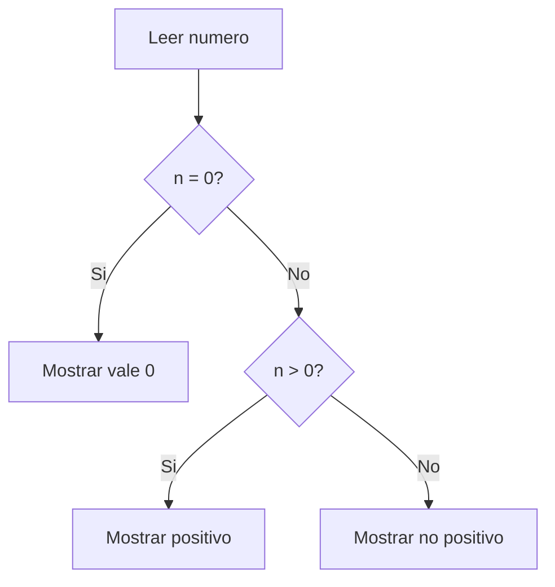

## Resolución de problemas


[[Indice]]

> [!NOTE] Contenidos
>  Aplicar estrategias sistemáticas para analizar problemas, identificando entradas, procesos y salidas, y representándolos mediante pseudocódigo inicial.

---

## Objetivos:

- [ ] Estrategias de resolución: casos, escenarios, requisitos. 
- [ ] Diagrama de flujo y pseudocódigo.
- [ ] Terminar pensamiento computacional

---

¿Nos quitará el trabajo la IA? Yo creo que no

---


Problema:

> Generen un algoritmo que elija los números mayores a 5 de la siguiente lista $[1, 5, 7, 4, 10, 15, 2]$


---

1. Leemos la lista
2. for numero en lista
3. if numero > 5:
4.   mostrar numero
5. else: saltar numero

---

note:

ver soluciones de ejercicios de la clase pasada

---

### ¿Cómo construir el código del algoritmo?


- ¿Qué queremos que haga el programa? ➡️ Contexto y limitaciones y qué esperamos que sea el resultado respecto al input.

-  <!-- .element: class="fragment" -->¿Qué datos necesitamos? ➡️ Input o sin input, qué información y dónde obtenerla.

- <!-- .element: class="fragment" -->¿Cómo el programa podría llevar a cabo lo que queremos que haga? ➡️ orden de las acciones, lógica de los pasos, cómo pasar de la información de entrada a la de salida.

---

Problema: calcular área de un rectángulo.

Identificar datos de entrada, proceso y salida.

note:

Hacer un ejemplo con números primero.

---
> [!STICKY|green right title]
> Matriz IPO
> Esto es una matriz IPO:
> Input – Process – Output


| Entrada:           | Proceso:                    | Salida |
| ------------------ | --------------------------- | ------ |
| - base<br>- altura | - multiplicar base × altura | - área |


---

Problema: Determinar si el promedio de 3 notas es suficiente para pasar el ramo o no. Hacer desk-check con N1 = 6.5, N2 = 2.9, N3 = 4.2.

Identificar datos de entrada, proceso y salida.

---

| Entrada:             | Proceso:                                                                                                  | Salida                 |
| -------------------- | --------------------------------------------------------------------------------------------------------- | ---------------------- |
| - N1<br>- N2<br>- N3 | - N_total = N1 + N2 + N3<br>- División =  $N\_total/3$<br>- analizar si "División" es mayor o menor a 4.0 | - Aprobado o reprobado |

---

Cuando hacemos 

N1 = 6.5

o

 N_total = N1 + N2 + N3

Lo que hacemos es asignar **variables**.

---

Es como cuando en matemáticas o físicas designamos un valor x = 5 o $\pi = 3, 1415\dots$.

note:

Las veremos con más profundidad más adelante, pero por ahora considérenlas los nombres para simplificar el valor que le asignamos.

---
#### Representación de un algoritmo

Podemos representar los algoritmos de distintas maneras. La semana pasada vimos una en pseudopasos o pseudocódigo.

Ej: ¿Cuál sería el pseudocódigo para determinar si un número es positivo o negativo?

---

1. Leer número
2. Si número es mayor que 0
3.    Mostrar "positivo"
4. Si no
5.    Mostrar "no positivo"

---

¿Qué arrojaría el código anterior para los números -5, 17, 4 y 0?

---
1. Leer número
2. Si número es igual a 0
3.    Mostrar "vale 0"
4. Si número es mayor a 0
5.    Mostrar "positivo"
6. Si no
7.    Mostrar "no positivo"

---

##### Diagrama de flujo:




---

- Hacer el diagrama de flujo para "reservar la sala de estudio en biblioteca". Para ello debe cumplir con:
1. Ingresar la solicitud (analizar qué información debe incluir la solicitud)
2. verificar disponibilidad
3. ver alternativas y elegir la primera
4. confirmar la reserva
5. incluir un bucle de búsqueda de horarios si no hay disponibilidad en el horario.

Por último, descríbele a alguien tu código y ve si siguiendo los pasos es posible o no concretar la acción.

note:

darles tiempo para hacerlo

---

Ingresar solicitud
      ↓
Verificar disponibilidad
      ↓
¿Disponible?
   /       \
 Sí         No
 ↓           ↓
Confirmar   Mostrar alternativas
 reserva        ↓
        Elegir horario
            ↓
        (volver a verificar)

---

### Pensamiento Computacional

|                                                                                 |                                                                                                              |
| ------------------------------------------------------------------------------- | ------------------------------------------------------------------------------------------------------------ |
| **Reconocimiento de Patrones**<br><br>Identificar elementos que se repiten.     | **Abstracción**<br><br>Simplificar lo más posible un problema complejo.                                      |
| **Descomposición de Problemas**<br><br>Dividir un problema en partes pequeñas.  | **Debugging**<br><br>Solucionar los problemas en el código para que este haga exactamente lo que debe hacer. |
| **Algoritmization**<br><br>Definir los pasos exactos para resolver el problema. |                                                                                                              |

---

### Abstracción

La abstracción, como ya hemos visto, es quedarse con lo importante y omitir los detalles irrelevantes. Un algoritmo no necesita que se le cuente toda la información disponible, solo lo necesario para resolver un problema.

---

### Ejemplo

Problema: Estoy pensando en mudarme, pero quiero calcular el costo de calefacción que ocuparía la vivienda para saber si es rentable ¿En qué debo fijarme?

---

- tipo de calefacción que emplea
- tipo de vivienda
- región y dirección
- tamaño de la vivienda
- cuántas personas la habitarán

---

Pero el algoritmo quizá solo ocupe

Cantidad de pellets comprada por los dueños anteriores.
Cantidad de horas que los dueños anteriores estaban en casa.

---

### Debugging

El debbugging es probar el código, encontrar errores en la **lógica** o en el **código**.

Ej

promedio = nota1 + nota2 / 2

---

``` python

nota1 = 7.0
nota2 = 6.0
promedio = nota1 + nota2 / 2
print(promedio)

```

---

Código correcto:

promedio = (nota1 + nota2) / 2

---

Esto sería un error de lógica, el programa hace lo que le pedimos que haga, pero eso no es lo que queríamos que hiciese.

<!-- .element: class="fragment" --> Un error de código sería uno que no permita que el código se ejecute. Ej:

---

``` python

numero1 = 6

print(numero1 + numero2)

```

note:

La IA es muy buena par debuggear problemas de sintaxis y algunos de lógica, pero no todos.

---

Entonces, el pensamiento computacional engloba todo lo anterior:

problema
↓
abstracción
↓
descomposición
↓
reconocimiento de patrones
↓
algoritmo
↓
prueba / debugging
↓
solución


---
![[Pasted image 20260313111213.png]]


---
## Objetivos:

- [ ] Estrategias de resolución: casos, escenarios, requisitos. 
- [ ] Diagrama de flujo y pseudocódigo.
- [ ] Terminar pensamiento computacional

---
### Tareas: 

- 
![[Pasted image 20260312172644.png]]


---
