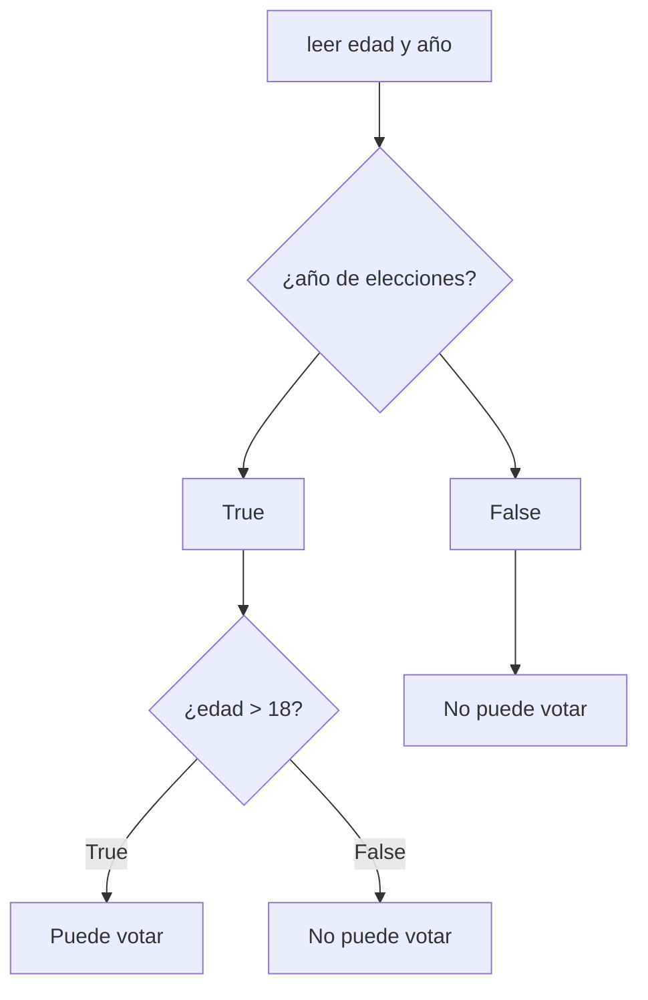

[[Indice]]

> [!NOTE] Contenidos
> 

---

## Objetivos:

- [ ] 

---

Diseño de soluciones 
▪ Abstracción. 
▪ Descomposición funcional. 
▪ Patrones algorítmicos (búsquedas, recorridos, cálculos 
simples).
Resultado de aprendizaje: Diseñar soluciones estructuradas a problemas 
simples aplicando abstracción funcional, modularidad y patrones 
algorítmicos.

Hacer ejercicios con reconocimiento de patrones y matemáticas.
Añadir algunas cosas buenas que deberían saber sobre computadores y buenas prácticas a la hora de programar
Decirles que es bueno tener creatividad y compañerismo

¿Por qué es bueno aprender pseudocódigo antes que código?

Es flexible y más cercano a cómo estructuramos nuestras ideas
Es más entendible para transmitir ideas y explicarle el código a personas que no entienden el lenguaje que tú manejas, dando mayor explicación entre miembros de un mismo equipo que manejen distintos lenguajes
Sirve para concentrarse primero en la lógica detrás del código antes que la complejidad en sí de lo que haya que hacer, por lo que se pueden detectar falencias en el código antes de implementarlo
Es más fácil manejar física o comportamientos complejos

Para pseudocódigo:

Tratar de mantener la coherencia, si bien no hay una sintaxis definida con reglas claras, trata de tú mantener tu sintaxis consistente
Concentrarte en la claridad del código más que en la complejidad

---
## Objetivos:

- [ ] 

---
### Tareas: 

- 

![[Pasted image 20260312173103.png]]

Problema: revisar si una persona puede votar o no.

| Entrada:                      | Proceso:                                            | Salida             |
| ----------------------------- | --------------------------------------------------- | ------------------ |
| - edad - año de elecciones | - revisar si es año de elecciones - revisar edad | - puede votar o no |

---

---

#### Desafío:

> Generar un algoritmo que arroje todos los números primos del 1 al 15.

note:

2, 3, 5, 7, 11, 13

dividir por los números menores a este y ver si retornan 

encontrar el mayor de 3 números.

---

max = primer número

para cada número
    si número > max
        max = número