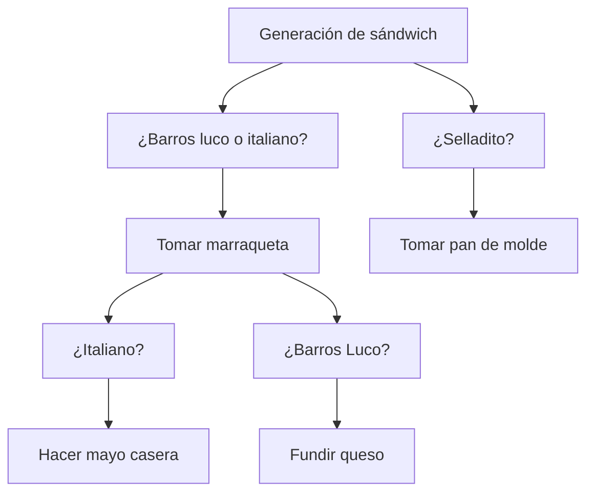

[[Indice]]

> [!NOTE] Contenidos
> Diseñar soluciones estructuradas a problemas simples aplicando abstracción funcional, modularidad y patrones algorítmicos.

---

## Objetivos:

- [ ]  Ahondar en la flexibilidad del pseudocódigo como herramienta
- [ ] Repasar y profundizar en los principales hitos del pensamiento computacional
- [ ] Buenas prácticas
- [ ] Ejercitar las habilidades fundamentales del pensamiento computacional

---

>[!CITE]
"A diferencia de lo que comúnmente se supone, no se necesita ser muy capaz en matemáticas o estudiar ciencia o ingeniería para poder aprender a programar: cualquier persona puede aprender a programar.
Para aprender a programar es necesaria una actividad fundamental: programar. ¿Esperaríamos que una persona aprendiese a conducir un automóvil sin manejar? ¿Esperaríamos que una persona aprendiese a dibujar sin dibujar?
El aprendizaje de la programación debe ser un proceso divertido e interesante; no tiene porque ser frustrante." 
     Gerardo Ayala

---

### Pseudocódigo

Estas semanas hemos estado aprendiendo a escribir pseudocódigo, que a diferencia del código en sí, no es legible por el computador.

Cabe preguntarse...

¿Por qué es bueno aprender pseudocódigo antes que código?

---

- Es flexible y más cercano a cómo estructuramos nuestras ideas
- Es más entendible para transmitir ideas y explicarle el código a personas que no entienden el lenguaje que tú manejas.
- Sirve para concentrarse primero en la lógica detrás del código antes que la complejidad en sí de lo que haya que hacer.
- Es más fácil manejar física o comportamientos complejos.

---

#### Características:

- El pseudocódigo no tiene una sintaxis definida o específica, pero debe ser entendible por cualquier persona que sepa programar.
- Lo principal en lo que se deben enfocar es la legibilidad antes que la complejidad.
- Traten de mantener una sintaxis consistente para darle mayor coherencia.
- Debe reflejar la lógica detrás del código, no solo lo que esperan que haga el código.
- Es muy útil para dividir los subprocesos.

---

** OJO **: No siempre necesitarán usar pseudocódigo en los ejercicios que les hagamos hacer, ej:

---
> Problema:
   Dar instrucciones para lava una taza.

---

¿Con agua fría o caliente?
¿Con detergente?
¿Cuánto tiempo?
¿Qué pasa si está muy sucia?

---

[[Semana 3 ej]]

---
### Pensamiento computacional

|                                                                                 |                                                                                                              |
| ------------------------------------------------------------------------------- | ------------------------------------------------------------------------------------------------------------ |
| **Reconocimiento de Patrones**  Identificar elementos que se repiten.     | **Abstracción**  Simplificar lo más posible un problema complejo.                                      |
| **Descomposición de Problemas**  Dividir un problema en partes pequeñas.  | **Debugging**  Solucionar los problemas en el código para que este haga exactamente lo que debe hacer. |
| **Algoritmization**  Definir los pasos exactos para resolver el problema. |                                                                                                              |

---

#### Reconocimiento de Patrones:

1. Calcular el total de una compra de 5 productos
2. Calcular la distancia total recorrida en 5 tramos

¿Qué tienen en común ambos procesos?
¿Qué tiene de diferente cada caso?

---

#### Descomposición de problemas:

Se desea modelar el proceso de **realizar un pedido de comida por una aplicación**.

1. Divida el problema en **al menos 4 subtareas** claramente diferenciadas que deberías realizar.
2. Para cada subtarea, escriba una breve descripción de qué hace. 
3. Indique en qué orden deben ejecutarse las subtareas.

---
Ej:

- seleccionar restaurante
- elegir productos
- realizar pago
- recibir pedido

---
#### Algoritmización

Una máquina expendedora funciona de la siguiente manera:

- el usuario selecciona un producto
- el sistema muestra el precio
- el usuario ingresa dinero
- si el dinero es exactamente el necesario → entrega producto
- si el dinero es mayor al necesario → entrega el producto y vuelto
- en otro caso → muestra mensaje de error

> Escriba el algoritmo en pseudocódigo.

---

1. leer producto seleccionado
2. leer precio del producto
3. leer dinero ingresado
4. si dinero = precio:
5.   entregar producto
6. si dinero es mayor al precio:
7.    vuelto = dinero - precio
8.   entregar producto seleccionado y precio
9. en otro caso:
10.   mostrar mensaje de error

---

#### Abstracción:

Se quiere modelar el proceso de **ir a la universidad**.

Se proponen los siguientes pasos:

- levantarse
- elegir ropa
- lavarse los dientes
- revisar el clima
- tomar transporte
- abrir la puerta de la casa
- cargar el celular
- caminar hacia el paradero
- bajarse de la micro
- leer en la micro
- llegar a la universidad

---
##### Preguntas

1. Identifique **2 pasos irrelevantes o demasiado específicos**.
2. Reescriba el proceso usando **máximo 4 pasos más generales** y ordenados.
3. Explique brevemente por qué su versión es más abstracta.

---

- prepararse para salir
- salir de casa
- trasladarse
- llegar a la U

---

### Tarea:

- Hacer la matriz IPO de "consumo de agua en casa". Calcular el consumo mensual de agua en $m^3$.
1. Usa la lectura anterior, la lectura actual y el costo del agua, y que de salida tenga el costo total y los $m^3$ consumidos.

---

[[Semana 3 ej]]

---

### Buenas prácticas:

- El pseudocódigo debe ser legible por humanos:

	x = a + b * c - f / e

No es lo mismo que:

	multiplicación = b y c
	división = f/e
	resultado = a + multiplicación - división

---

Traten de meter muchas instrucciones en una misma línea:

	 Leer a, b, mostrar c, calcular e/f

No es lo mismo que:

	Leer a
	Leer b
	Leer c
	Mostrar c
	Dividir e y f

---
Usar variables entendibles:

	x = a + b

No es lo mismo que:

	suma = numero1 + numero2

---
No pueden ser ambiguos:

	Hacer cálculo

No es lo mismo que

	promedio = (nota1 + nota2)/2

---
Algunos tips:

- Explicarle a otra persona el paso a paso
- Piensen antes de escribir, revisen con números

---

### Ejercicios tipo

Repasemos un poco los ejercicios semana a semana...

---

 1.  

Conseguiste trabajo como cocinero en una sandwichería de lujo. Eres un gran experto en ello. Te piden hacer una masterclass para preparar tus 3 mejores sándwiches. Cada alumno podrá elegir aprender hacer uno de los 3 sándwiches culmines de tu carrera, sin embargo, será una sola clase para todos estos alumnos, por lo que tendrás que repartirte entre los que quieren aprender uno u otro sándwich.

1. Escribe el paso a paso de cómo armar 3 sándwiches deliciosos, con al menos 6 pasos y 5 ingredientes cada uno, especificando también el tipo de pan, si hay que calentarlo o no, y los pasos para freír o cocinar cualquier ingrediente.

| pasos  | sándwich 1 | sándwich 2 | sándwich 3 |
| ------ | ---------- | ---------- | ---------- |
| paso 1 |            |            |            |
| paso 2 |            |            |            |
| paso 3 |            |            |            |
|        |            |            |            |
2. Piensa en qué ocurre si tu proveedor de algún ingrediente falla justo antes de la clase, ¿Cómo reemplazarías el ingredientes.
3. Señala para cada sándwich los pasos que omitiste conscientemente y explica el porqué.
4. Pásale tu instructivo a otra persona y pregúntale si cree que falta algún paso o si sobra alguno y discutan porqué agregar/quitar o no ese paso.

---

 2.  

1. Para el problema anterior, identifica las entradas y salidas del proceso de generación de cada sándwich.

| pasos      | Inputs | Proceso | Outputs |
| ---------- | ------ | ------- | ------- |
| sándwich 1 |        |         |         |
| sándwich 2 |        |         |         |
| sándwich 3 |        |         |         |

2. Detalla el paso a paso de al menos 1 subproceso que tenga cada uno de tus sándwiches (ej: cómo coccionar la carne, cómo hacer la mayo casera).
3. Analiza los pasos del proceso en común que tienen los 3 sándwiches, si comparten ingredientes o tienen pasos similares.

---

 3. 

1. Genera un diagrama de flujo común para los 3 procesos, incluyendo ramificaciones para cada caso, para hacer algo como esto:

2. Redacta el pseudocódigo de tu proceso, que englobe el poder elegir hacer cualquiera de estos sándwiches.

---
## Objetivos:

- [ ]  Ahondar en la flexibilidad del pseudocódigo como herramienta
- [ ] Repasar y profundizar en los principales hitos del pensamiento computacional
- [ ] Buenas prácticas
- [ ] Ejercitar las habilidades fundamentales del pensamiento computacional

---
### Tareas: 

- Dada una lista de 8 temperaturas, diseña un algoritmo con dos subprocedimientos: maximo() y minimo(), de modo que el algoritmo sea capaz de entregar la temperatura más alta y la más baja como salida.

---

- Te piden programar el agendar ayudantías. 
1. Analiza los distintos subprocedimientos (módulos): validación de la ayudantía, conflicto de horarios del ayudante, confirmación, búsqueda de salas, etc. Describe la interfaz (entradas/salidas) de cada módulo.
2. Propón un diseño del flujo entre los módulos.
3. Piensa en otra situación similar donde también puedas reutilizar este flujo con muy pequeños cambios.

---
