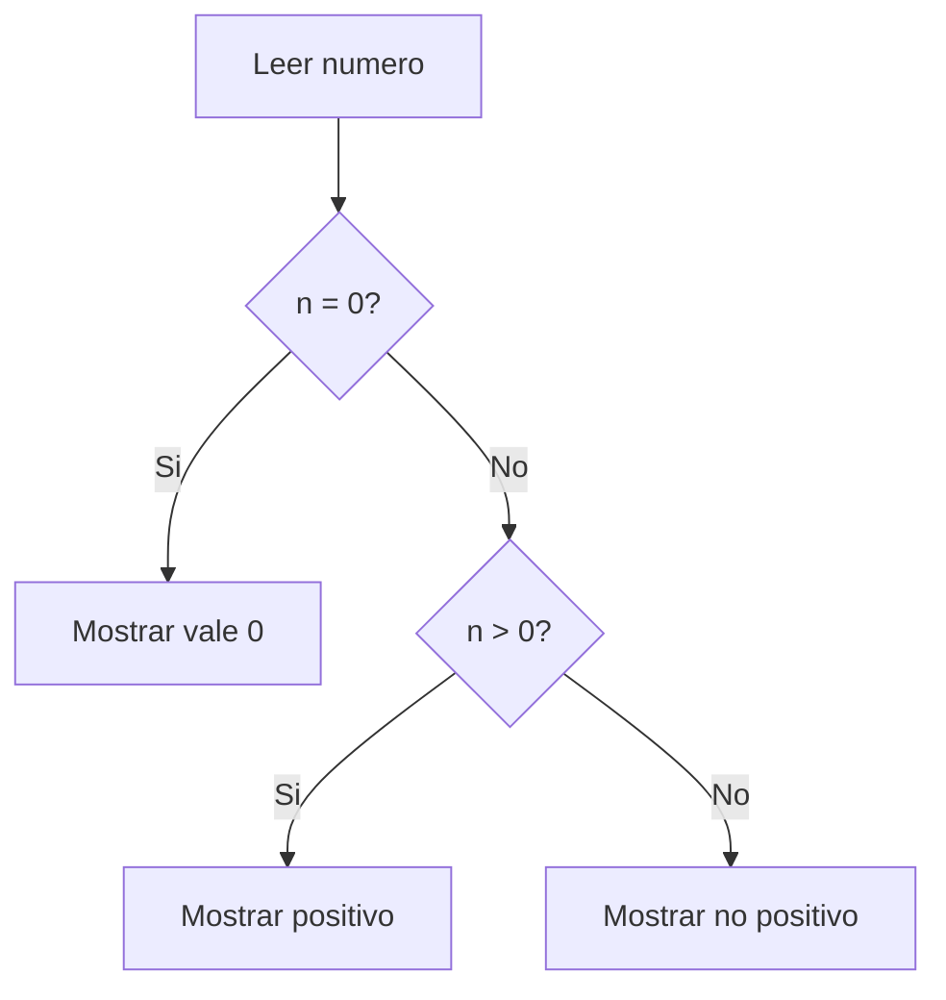
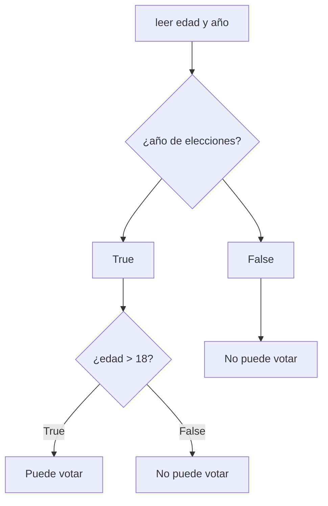

## Resolución de problemas


[[Indice]]

> [!NOTE] Contenidos
>  Aplicar estrategias sistemáticas para analizar problemas, identificando entradas, procesos y salidas, y representándolos mediante pseudocódigo inicial.

---

## Objetivos:

- [ ] Estrategias de resolución: casos, escenarios, requisitos. 
- [ ] Diagrama de flujo y pseudocódigo.
- [ ] Terminar pensamiento computacional.


---


Problema:

> Generen un algoritmo que muestre los números mayores a 5 de la siguiente lista $[1, 5, 7, 4, 10, 15, 2]$


---

[[Semana 2 ej]]

---
### ¿Cómo construir el código del algoritmo?


- ¿Qué queremos que haga el programa?

-  ¿Qué datos necesitamos?

- ¿Cómo el programa podría llevar a cabo lo que queremos que haga?

---

- ¿Qué queremos que haga el programa? ➡️ Contexto y limitaciones y qué esperamos que sea el resultado respecto al input.

-  ¿Qué datos necesitamos? ➡️ Input o sin input, qué información y dónde obtenerla.

- ¿Cómo el programa podría llevar a cabo lo que queremos que haga? ➡️ orden de las acciones, lógica de los pasos, cómo pasar de la información de entrada a la de salida.

---

Problema: calcular área de un rectángulo.

Identificar datos de entrada, proceso y salida.

---
> [!STICKY|green right title]
> Matriz IPO
> Esto es una matriz IPO:
> Input – Process – Output


| Entrada:           | Proceso:                    | Salida |
| ------------------ | --------------------------- | ------ |
| - base<br>- altura | - multiplicar base × altura | - área |


---

Problema: Determinar si el promedio de 3 notas es suficiente para pasar el ramo o no. Hacer desk-check con N1 = 6.5, N2 = 2.9, N3 = 4.2.

Identificar datos de entrada, proceso y salida.

---
#### Variables:

Cuando hacemos N1 = 6.5 o  N_total = N1 + N2 + N3, lo que hacemos es nombrar variables.

Es similar a en matemáticas o física cuando decimos que x = 5.

---
#### Representación de un algoritmo

Podemos representar los algoritmos de distintas maneras. La semana pasada vimos una en pseudopasos o pseudocódigo.

Ej: ¿Cuál sería el pseudocódigo para determinar si un número es positivo o negativo?

---

1. Leer número
2. Si número es mayor que 0
3.    Mostrar "positivo"
4. Si no
5.    Mostrar "no positivo"

---

¿Qué arrojaría el código anterior para los números -5, 17, 24/3 y 0?

---
1. Leer número
2. Si número es igual a 0
3.    Mostrar "vale 0"
4. Si número es mayor a 0
5.    Mostrar "positivo"
6. Si no
7.    Mostrar "negativo"

---

##### Diagrama de flujo:



---


Problema: revisar si una persona puede votar o no. Fijarse en:

- año de elecciones
- edad

---

| Entrada:                      | Proceso:                                            | Salida             |
| ----------------------------- | --------------------------------------------------- | ------------------ |
| - edad<br>- año de elecciones | - revisar si es año de elecciones<br>- revisar edad | - puede votar o no |

---




---

- Hacer el diagrama de flujo para "reservar la sala de estudio en biblioteca". Para ello debe cumplir con:
1. Ingresar la solicitud (analizar qué información debe incluir la solicitud)
2. verificar disponibilidad
3. ver alternativas y elegir la primera
4. confirmar la reserva

---

### Pensamiento Computacional

|                                                                                 |                                                                                                              |
| ------------------------------------------------------------------------------- | ------------------------------------------------------------------------------------------------------------ |
| **Reconocimiento de Patrones**<br><br>Identificar elementos que se repiten.     | **Abstracción**<br><br>Simplificar lo más posible un problema complejo.                                      |
| **Descomposición de Problemas**<br><br>Dividir un problema en partes pequeñas.  | **Debugging**<br><br>Solucionar los problemas en el código para que este haga exactamente lo que debe hacer. |
| **Algoritmization**<br><br>Definir los pasos exactos para resolver el problema. |                                                                                                              |

---

### Abstracción

La abstracción, como ya hemos visto, es quedarse con lo importante y omitir los detalles irrelevantes. Un algoritmo no necesita que se le cuente toda la información disponible, solo lo necesario para resolver un problema.

---

### Ejemplo

Problema: Estoy pensando en mudarme, pero quiero calcular el costo de calefacción que ocuparía la vivienda para saber si es rentable ¿En qué debo fijarme?

---

- tipo de calefacción que emplea
- tipo de vivienda
- región y dirección
- tamaño de la vivienda
- cuántas personas la habitarán

---

Pero el algoritmo quizá solo ocupe

Cantidad de pellets comprada por los dueños anteriores.
Cantidad de horas que los dueños anteriores estaban en casa.

---

- Piensa en el proceso de "comprar desayuno en el kiosko del campus".

1. Lista al menos 6 pasos del proceso (cómo dividirías la tarea). 
2. Analiza si estás omitiendo algún detalle relevante o si estás incorporando detalles irrelevantes sin darte cuenta (vamos a analizar el nivel de abstracción de nuestra solución).
3. Identifica los patrones (¿Qué se repetiría si eliges una opción del menú u otra?)
4. Redacta el algoritmo del proceso.

---

### Debugging

El debbugging es probar el código, encontrar errores en la **lógica** o en el **código**.

Ej

promedio = nota1 + nota2 / 2

---

``` python

nota1 = 7.0
nota2 = 6.0
promedio = nota1 + nota2 / 2
print(promedio)

```

---

Código correcto:

promedio = (nota1 + nota2) / 2

---

Esto sería un error de lógica, el programa hace lo que le pedimos que haga, pero eso no es lo que queríamos que hiciese.

 Un error de código sería uno que no permita que el código se ejecute. Ej: <!-- .element: class="fragment" -->

---

Entonces, el pensamiento computacional engloba todo lo anterior:

problema
↓
abstracción
↓
descomposición
↓
reconocimiento de patrones
↓
algoritmo
↓
prueba / debugging
↓
solución


---
## Objetivos:

- [ ] Estrategias de resolución: casos, escenarios, requisitos. 
- [ ] Diagrama de flujo y pseudocódigo.
- [ ] Terminar pensamiento computacional

---
### Tareas: 

- Escribe el pseudocódigo para comparar emisiones de bus vs auto compartido. y decidir cuál opción ocupar.
1. Piensa en los factores como kilómetros recorridos, y emisión de cada tipo de vehículo (no necesitas investigar cuánto emite cada tipo de vehículo, inventa un número).
2. Genera la matriz IPO y el seudocódigo de esto.

---

- Verifica la lógica desk-check del pseudocódigo anterior. 
1. Construye una tabla de trazas con 3 juegos de datos, una donde el auto genere más emisiones, otra donde el bus genere más emisiones y otra donde generen la misma cantidad de emisiones por km. 

---
[[Semana 3 ej]]