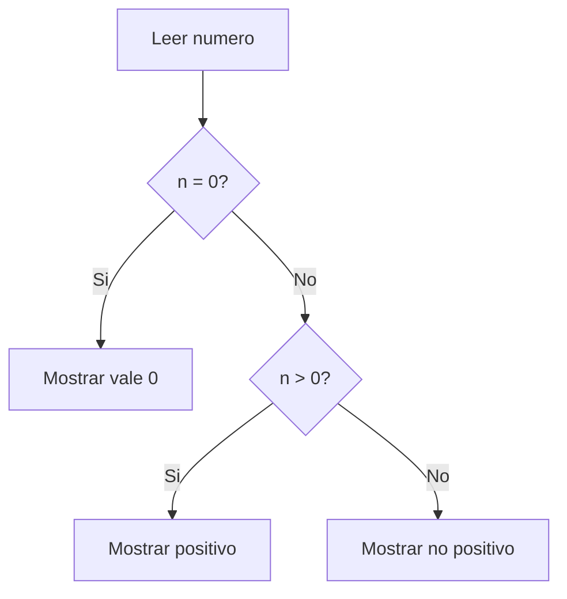

---

##### Matriz IPO

> [!STICKY|green right title]
> Matriz IPO
> Esto es una matriz IPO:
> Input – Process – Output

| Entrada:           | Proceso:                    | Salida |
| ------------------ | --------------------------- | ------ |
| - base - altura | - multiplicar base × altura | - área |

---
##### Diagrama de flujo:

---

##### pseudocódigo:

1. Leer dígitos
2. si a > b entonces
    mostrar a
3. si a < b
	mostrar b
4. si a = b
	decir que ambos son iguales